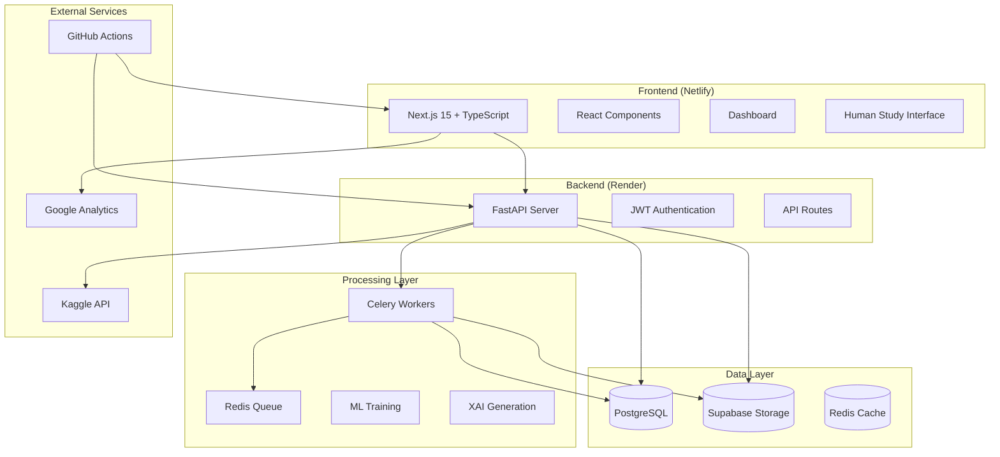
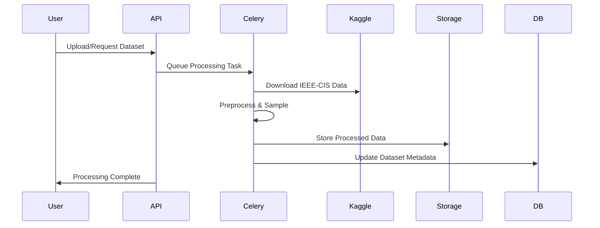
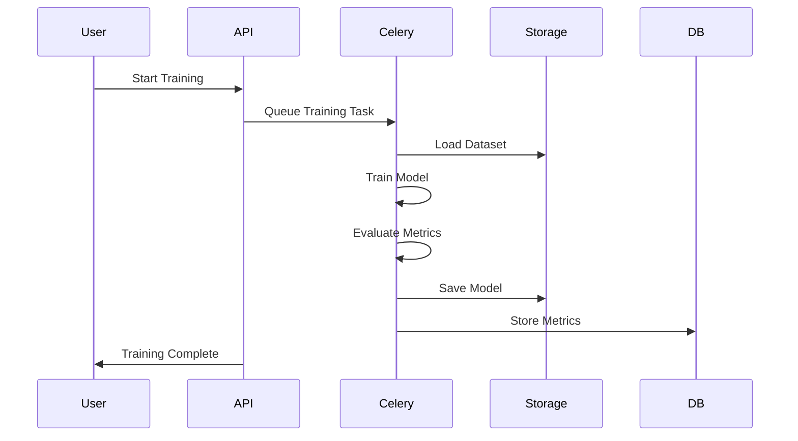
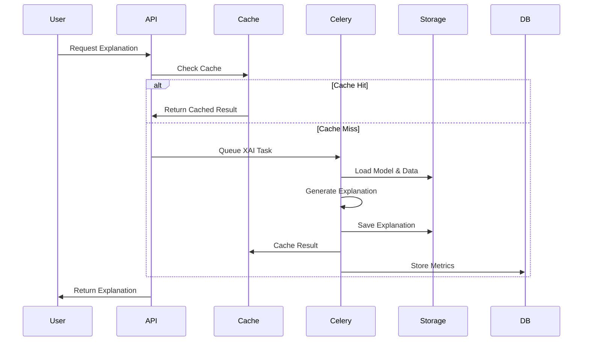

# XAI Finance Benchmark Platform - Architecture

## Overview

The XAI Finance Benchmark Platform is a full-stack research application designed to evaluate explainable AI methods in financial fraud detection. The platform supports reproducible benchmarking, human-centered evaluation, and regulatory compliance reporting.

## System Architecture



## Technology Stack

### Frontend
- **Framework**: Next.js 15 with App Router
- **Language**: TypeScript
- **Styling**: TailwindCSS + shadcn/ui components
- **State Management**: React Query + Zustand
- **Charts**: Recharts + D3.js
- **Deployment**: Netlify

### Backend
- **Framework**: FastAPI (Python 3.11)
- **Database**: PostgreSQL with SQLAlchemy ORM
- **Cache**: Redis
- **Task Queue**: Celery with Redis broker
- **Authentication**: JWT tokens
- **Deployment**: Render

### ML & XAI Stack
- **ML Libraries**: scikit-learn, XGBoost, LightGBM, CatBoost
- **XAI Libraries**: SHAP, LIME, DiCE, Quantus
- **Data Processing**: pandas, numpy
- **Model Storage**: Joblib, Pickle

### Infrastructure
- **Containerization**: Docker + Docker Compose
- **CI/CD**: GitHub Actions
- **Storage**: Supabase (files, backups)
- **Monitoring**: Structured logging, health checks

## Data Flow Architecture

### 1. Dataset Processing Flow


### 2. Model Training Flow


### 3. Explanation Generation Flow


## Database Schema

### Core Tables

#### Datasets
```sql
CREATE TABLE datasets (
    id UUID PRIMARY KEY,
    name VARCHAR(255) NOT NULL,
    source VARCHAR(100),
    status VARCHAR(20),
    total_rows INTEGER,
    file_path VARCHAR(500),
    feature_statistics JSONB,
    created_at TIMESTAMP,
    processed_at TIMESTAMP
);
```

#### Models
```sql
CREATE TABLE models (
    id UUID PRIMARY KEY,
    name VARCHAR(255) NOT NULL,
    model_type VARCHAR(50) NOT NULL,
    dataset_id UUID REFERENCES datasets(id),
    hyperparameters JSONB,
    model_path VARCHAR(500),
    model_hash VARCHAR(64),
    status VARCHAR(20),
    created_at TIMESTAMP,
    training_completed_at TIMESTAMP
);
```

#### Explanations
```sql
CREATE TABLE explanations (
    id UUID PRIMARY KEY,
    name VARCHAR(255) NOT NULL,
    method VARCHAR(50) NOT NULL,
    explanation_type VARCHAR(20) NOT NULL,
    model_id UUID REFERENCES models(id),
    dataset_id UUID REFERENCES datasets(id),
    explanation_path VARCHAR(500),
    cache_key VARCHAR(255),
    is_cached BOOLEAN DEFAULT FALSE,
    created_at TIMESTAMP
);
```

#### Study Sessions
```sql
CREATE TABLE study_sessions (
    id UUID PRIMARY KEY,
    session_id VARCHAR(50) UNIQUE NOT NULL,
    condition VARCHAR(20) NOT NULL,
    status VARCHAR(20),
    consent_given BOOLEAN DEFAULT FALSE,
    total_interactions INTEGER DEFAULT 0,
    created_at TIMESTAMP,
    completed_at TIMESTAMP
);
```

## API Design

### RESTful Endpoints

#### Authentication
- `POST /api/v1/auth/register` - Register researcher
- `POST /api/v1/auth/login` - Login researcher
- `GET /api/v1/auth/me` - Get current user
- `POST /api/v1/auth/refresh` - Refresh token

#### Datasets
- `GET /api/v1/datasets` - List datasets
- `POST /api/v1/datasets/upload` - Upload dataset
- `GET /api/v1/datasets/{id}` - Get dataset details
- `POST /api/v1/datasets/{id}/preprocess` - Trigger preprocessing

#### Models
- `GET /api/v1/models` - List models
- `POST /api/v1/models/train` - Train model
- `GET /api/v1/models/{id}` - Get model details
- `GET /api/v1/models/{id}/metrics` - Get model metrics
- `GET /api/v1/models/leaderboard` - Performance leaderboard

#### Explanations
- `POST /api/v1/explanations/generate` - Generate explanation
- `GET /api/v1/explanations/{id}` - Get explanation
- `POST /api/v1/explanations/compare` - Compare methods
- `GET /api/v1/explanations/methods` - Available methods

#### Human Study
- `POST /api/v1/study/sessions` - Create study session
- `GET /api/v1/study/sessions/{id}` - Get session
- `POST /api/v1/study/interactions` - Log interaction
- `GET /api/v1/study/results` - Export results

## Security Architecture

### Authentication & Authorization
- **JWT Tokens**: Stateless authentication for researchers
- **Session IDs**: Pseudonymous identifiers for study participants
- **Role-Based Access**: Researcher vs. participant permissions
- **Token Expiration**: 30-minute access tokens

### Data Security
- **Encryption**: HTTPS everywhere, encrypted storage
- **Anonymization**: No personal data, hashed IPs
- **Data Retention**: 6-month policy with automatic cleanup
- **GDPR Compliance**: Consent tracking, data portability

### Infrastructure Security
- **Container Security**: Minimal base images, security scanning
- **Network Security**: VPC isolation, firewall rules
- **Secrets Management**: Environment variables, no hardcoded secrets
- **Monitoring**: Structured logging, health checks

## Scalability Considerations

### Horizontal Scaling
- **Stateless API**: Multiple backend instances
- **Worker Scaling**: Auto-scaling Celery workers
- **Database**: Read replicas for analytics
- **CDN**: Static asset distribution

### Performance Optimization
- **Caching Strategy**: Redis for explanations, HTTP caching
- **Database Indexing**: Optimized queries, proper indexes
- **Async Processing**: Non-blocking operations
- **Data Sampling**: Automatic sampling for large datasets

### Resource Management
- **Memory Limits**: 2-4GB per worker
- **CPU Optimization**: Multi-core processing
- **Storage Efficiency**: Compressed models, cleanup jobs
- **Rate Limiting**: API throttling, queue management

## Monitoring & Observability

### Application Monitoring
- **Health Checks**: Kubernetes-style probes
- **Structured Logging**: JSON logs with correlation IDs
- **Metrics Collection**: Performance and business metrics
- **Error Tracking**: Centralized error reporting

### Infrastructure Monitoring
- **Resource Usage**: CPU, memory, disk monitoring
- **Database Performance**: Query performance, connection pools
- **Queue Monitoring**: Celery task metrics via Flower
- **Network Monitoring**: Response times, error rates

## Deployment Architecture

### Development Environment
```yaml
# docker-compose.yml
services:
  postgres:
    image: postgres:15
  redis:
    image: redis:7
  backend:
    build: ./backend
    depends_on: [postgres, redis]
  celery:
    build: ./backend
    command: celery worker
  frontend:
    build: ./frontend
    ports: ["3000:3000"]
```

### Production Environment
- **Frontend**: Netlify (CDN, auto-scaling)
- **Backend**: Render (container deployment)
- **Database**: Managed PostgreSQL
- **Cache**: Managed Redis
- **Storage**: Supabase (file storage, backups)

### CI/CD Pipeline
1. **Code Push** → GitHub
2. **Tests** → GitHub Actions (unit, integration, security)
3. **Build** → Docker images
4. **Deploy** → Render (backend), Netlify (frontend)
5. **Health Check** → Automated verification

## Compliance & Governance

### EU AI Act Compliance
- **Transparency**: Model documentation, explanation methods
- **Human Oversight**: Researcher controls, human study data
- **Risk Assessment**: Automated audit reports
- **Documentation**: Comprehensive logging and reporting

### Research Ethics
- **Informed Consent**: Clear consent process for participants
- **Data Minimization**: Only necessary data collection
- **Anonymization**: No personal identifiers
- **Right to Withdraw**: Session termination capability

### Quality Assurance
- **Reproducibility**: Versioned models, deterministic processes
- **Validation**: Cross-validation, holdout testing
- **Benchmarking**: Standardized evaluation metrics
- **Documentation**: Comprehensive API and user documentation
